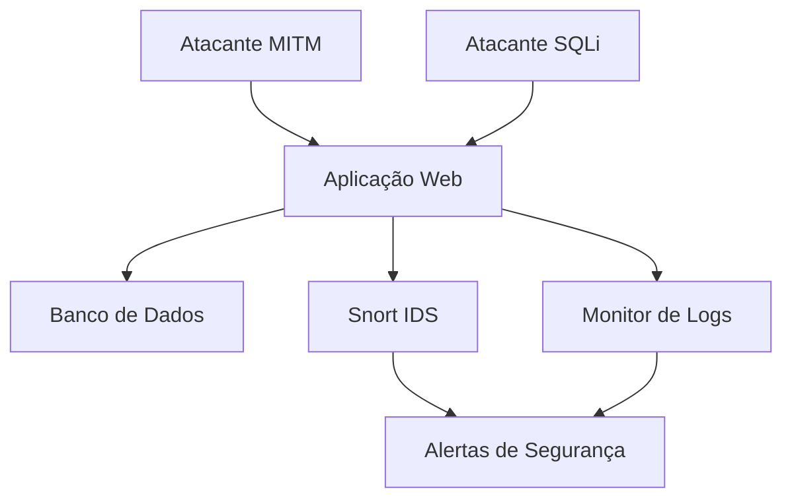

# Laboratório de Segurança Cibernética - TP2

 


## 📌 Visão Geral

Laboratório completo para simulação, detecção e prevenção de ataques cibernéticos, com foco em:
- **SQL Injection**
- **Man-in-the-Middle (MITM)**
- Monitoramento em tempo real
- Análise forense pós-ataque

## 🛠️ Arquitetura do Sistema



## 🖥️ Componentes Principais

### 1. Aplicação Web Vulnerável
- **Tecnologia**: PHP 8.1 + Apache
- **Finalidade**: Alvo intencional para ataques
- **Vulnerabilidades**:
  - Formulários sem sanitização
  - Páginas sem HTTPS
  - Falta de CSRF tokens
- **Porta**: `8080`

### 2. Serviços de Defesa
| Componente       | Função                                  | Tecnologia          |
|------------------|----------------------------------------|--------------------|
| **Snort IDS**    | Detecção de padrões maliciosos         | Regras personalizadas |
| **Monitor**      | Análise de logs em tempo real          | Python 3.11        |
| **MySQL**        | Banco de dados com hardening básico    | MariaDB 10.5       |

### 3. Ferramentas de Ataque
| Ataque           | Scripts Incluídos                      | Dificuldade        |
|------------------|----------------------------------------|--------------------|
| **SQL Injection**| Bypass auth, UNION attacks, Blind SQLi | Fácil-Moderado     |
| **MITM**         | ARP spoofing, SSL stripping            | Moderado-Difícil   |

## 🚀 Implementação

### Pré-requisitos
- Docker 20.10+
- Docker Compose 2.0+
- 4GB RAM disponível

### Instalação
```bash
git clone [repositorio]
cd TP2
docker-compose up --build -d
```

### Configurações Chave
```env
# Arquivo .env (opcional)
DB_HOST=db
DB_USER=root
DB_PASS=dvwa
DB_NAME=dvwa
```

## ⚔️ Ataques Implementados

### SQL Injection
- **Bypass de Autenticação**:
  ```bash
  curl "http://localhost:8080?user=' OR 1=1 -- &pass=any"
  ```
- **Técnicas Avançadas**:
  - Exfiltração de dados via UNION
  - Blind SQLi baseado em tempo

### Man-in-the-Middle
```python
# ARP Spoofing
python mitm/arp_spoof.py -t [target_ip] -g [gateway_ip]
```

## 🛡️ Mecanismos de Defesa

### Snort IDS
**Regras Personalizadas**:
```conf
alert tcp any any -> any 80 (msg:"SQLi Detectado"; content:"UNION"; nocase; sid:10001;)
alert tcp any any -> any 80 (msg:"Tentativa MITM"; content:"HTTP/1.1"; offset:0; depth:8; sid:10002;)
```

### Monitor de Logs
**Padrões Monitorados**:
- Padrões SQL maliciosos
- Requisições HTTP anômalas
- Atividade ARP suspeita

## 📊 Dashboard de Monitoramento

Acesse os logs em tempo real:
```bash
# Snort alerts
docker logs snort -f

# Monitor
docker logs monitor -f
```

## 🧪 Testes Automatizados

Execute a suíte de testes:
```bash
./test_attacks.sh
```

**Cobertura de Testes**:
1. Testes de SQLi básico
2. Simulação MITM
3. Verificação de defesas

## 📚 Documentação Adicional

| Arquivo               | Descrição                          |
|-----------------------|-----------------------------------|
| `docs/snort_rules.md` | Guia de regras personalizadas     |
| `docs/mitm_guide.md`  | Metodologias de ataque MITM       |
| `docs/hardening.md`   | Recomendações de segurança        |

## ⚠️ Aviso Legal

Este laboratório deve ser utilizado **apenas** para:
- Pesquisa acadêmica
- Testes em ambientes controlados
- Educação em segurança cibernética

## 👨💻 Desenvolvimento

Para contribuir:
```bash
1. Fork o repositório
2. Crie sua branch: git checkout -b feature/nova-funcionalidade
3. Commit suas mudanças
4. Push para a branch: git push origin feature/nova-funcionalidade
5. Abra um Pull Request
```

## 📞 Suporte

Para problemas técnicos, abra uma issue no [GitHub](https://github.com/seu-repositorio/issues)
